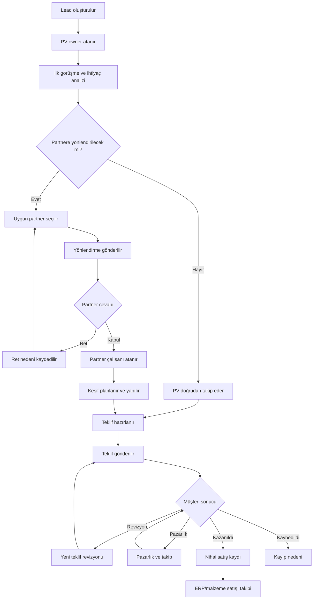
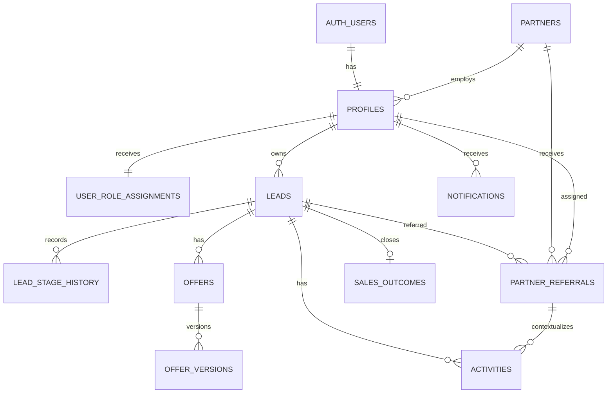

# PV Solutions CRM — Claude Code Ana Sistem ve İşleyiş Dokümanı

> Bu doküman Claude Code'a projenin bütününü anlatmak için hazırlanmıştır. Bir kerede bütün sistemi kodlama talimatı değildir. Önce tamamını oku, çelişki veya eksik kararları listele, mimari planı çıkar; daha sonra modülleri sırayla ve ayrı görevler halinde geliştir.

## 0. Claude Code için çalışma talimatı

Bu proje sıfırdan kurulacak, bağımsız bir **PV Solutions CRM** uygulamasıdır. Mevcut bir kod tabanı, Supabase şeması veya eski migration bulunmadığı varsayılmalıdır. Uygulama PV Solutions'ın kendi satış ekibi ile iş ortakları/bayileri arasındaki müşteri yönlendirme ve satış takibini yönetecektir.

Teknoloji hedefi:

- Next.js App Router
- TypeScript
- Tailwind CSS
- Supabase Database ve Auth
- Supabase Row Level Security
- Vercel deployment
- npm
- Node.js 22 veya üzeri

Geliştirme sırasında aşağıdaki kurallara uy:

1. Bu dokümanın tamamını okumadan kod yazma.
2. İlk cevapta sistemi kendi cümlelerinle özetle.
3. Belirsiz, çelişkili veya teknik risk taşıyan noktaları listele.
4. Ardından modül bazlı geliştirme planı öner.
5. Bir görevde yalnızca açıkça istenen modülü geliştir; tüm sistemi tek seferde kurmaya çalışma.
6. Her database değişikliği için yeni ve sıralı migration oluştur. Migration dosyasını önce `supabase migration new <açıklayıcı-ad>` komutuyla üret.
7. Daha önce çalıştırılmış migration dosyasını geriye dönük değiştirme.
8. Database kurallarını yalnızca frontend doğrulamasına bırakma. Uygun olan yerlerde foreign key, check constraint, unique/partial unique index, trigger ve RLS kullan.
9. `service_role` veya secret key'i tarayıcıya gönderme. `NEXT_PUBLIC_` değişkenlerinde yalnızca URL ve publishable key olabilir.
10. Next.js cookie tabanlı oturumlar için güncel resmi yaklaşıma göre `@supabase/ssr` kullan. Browser ve server client'larını ayır. Route korumasında yalnızca cookie varlığına veya `getSession()` içindeki kullanıcı nesnesine güvenme; güncel resmi doğrulama yöntemini kullan.
11. Yetkilendirme kararlarında kullanıcının değiştirebildiği `user_metadata` alanını kullanma. Rol ve organizasyon üyeliğini korumalı database tablolarında tut.
12. `public` şemasındaki bütün uygulama tablolarında RLS açık olmalı.
13. Yeni Supabase projelerinde tablolar Data API'ye otomatik açılmayabileceği için gerekli `GRANT` işlemlerini migration içinde açık ve en az yetki prensibine göre tanımla. `GRANT`, RLS'nin yerine geçmez; ikisi birlikte uygulanır.
14. RLS politikalarında yalnızca `TO authenticated` yazmak yeterli değildir. Satır bazında owner, partner ve atanan çalışan koşulları bulunmalıdır.
15. UPDATE politikalarında hem `USING` hem `WITH CHECK` kullan.
16. RLS içinde kullanılan ve primary key olmayan `owner_id`, `partner_id`, `assigned_employee_id`, `lead_id` gibi sütunları indeksle.
17. View oluşturulursa mümkünse `security_invoker = true` kullan veya view'ı erişime kapat.
18. Permission hatasını çözmek için rastgele `SECURITY DEFINER` ekleme. Gerçekten gerekirse fonksiyonu exposed olmayan şemaya koy, `search_path` değerini sabitle, çağıranı doğrula ve execute yetkilerini açıkça sınırla.
19. Yeni paket kurmadan önce neden gerektiğini açıkla; sürümü sabitle ve lockfile'ı güncelle.
20. Her görev sonunda typecheck, lint, test ve production build çalıştır. Yapamadığın testi yapılmış gibi gösterme.
21. Tasarımda statik örnek veriler daha sonra gerçek Supabase sorgularıyla değiştirilmelidir; üretimde sahte KPI bırakılmamalıdır.
22. Türkçe kullanıcı arayüzü oluştur. Kod, tablo ve enum adları İngilizce ve tutarlı olabilir.
23. Tarih/saat verilerini database'de `timestamptz` olarak sakla; arayüzde Türkiye saatine göre göster.
24. Para alanlarını floating point ile tutma; `numeric(14,2)` gibi kesin tip kullan ve para birimini ayrıca sakla.
25. Silme gerektiren ana iş kayıtlarında fiziksel silme yerine durum/pasiflik yaklaşımını tercih et. Audit geçmişini bozma.

Bu dokümanla ilgili ilk görevin **kod yazmak değil**, dokümanı okuyup şu çıktıları vermektir:

- Sistemin 15–25 maddelik özeti
- Ana modüller
- Rol ve erişim modelinin özeti
- Önerilen tablo ilişkileri
- Riskli veya karar gerektiren noktalar
- Aşamalı geliştirme planı
- İlk geliştirilecek tek küçük görev önerisi

---

## 1. Ürünün amacı

PV Solutions, güneş enerjisi sistemleri için müşteri adayları toplar. Bazı müşteriler doğrudan PV satış ekibi tarafından takip edilir; bazıları bölge, uzmanlık veya kapasite durumuna göre bir partner/bayiye yönlendirilir. Partner müşteriyle görüşür, keşif yapar, teklif hazırlar ve satış sonucunu sisteme girer. PV Solutions ise bütün sürecin zamanında ilerleyip ilerlemediğini, hangi partnerin hangi müşteriyi takip ettiğini, tekliflerin durumunu, satış sonuçlarını ve partner performansını tek merkezden görmek ister.

Bu CRM'in ana problemi şudur:

- Lead'ler Excel, telefon, web sitesi, kampanya ve çalışan notları arasında kaybolmamalı.
- Her lead'in şirket içindeki sorumlusu belli olmalı.
- Bir lead'in hangi partnere ne zaman yönlendirildiği görünmeli.
- Partnerin yönlendirmeyi kabul edip etmediği ve müşteriye dönüş yapıp yapmadığı izlenmeli.
- Keşif, teklif, revizyon, pazarlık ve satış sonucu geçmişi kaybolmamalı.
- Partner yalnızca kendi firmasına ait kayıtları görmeli.
- PV'nin iç notları partner tarafından görülmemeli.
- Geciken takip ve cevapsız yönlendirmeler bildirim üretmeli.
- Kazanılan ve kaybedilen satışlar nedenleriyle raporlanmalı.
- Yönetici; owner, partner, bölge, kaynak ve tarih bazında performans görebilmeli.

### 1.1 Başarı tanımı

Sistem başarılı sayılırsa:

- Yeni lead 2–3 dakika içinde eksiksiz açılabilir.
- Her açık lead'in owner'ı ve bir sonraki takip tarihi görülebilir.
- Aynı lead yanlışlıkla iki aktif partnere yönlendirilemez.
- Partner başka bir partnerin verisini hiçbir API sorgusuyla okuyamaz.
- Geciken partner cevapları ve müşteri takipleri dashboard'da görünür.
- Teklif revizyonları birbirini ezmeden saklanır.
- Kayıp satış, kayıp nedeni olmadan kapatılamaz.
- Aşama değişiklikleri otomatik geçmiş oluşturur.
- Yönetici raporları gerçek kayıtlarla hesaplanır.

### 1.2 İlk sürümde kapsam dışı alanlar

MVP'nin gereksiz büyümemesi için aşağıdakiler ilk sürümde yapılmayacaktır:

- Tam muhasebe veya finans modülü
- Fatura onay sistemi
- Stok/depo veya QR sistemi
- Proje/şantiye yönetimi
- Teklif PDF'inin gelişmiş tasarım editörü
- WhatsApp veya e-posta ile otomatik mesaj gönderme
- ERP ile çift yönlü canlı entegrasyon
- Partner komisyon hesaplama
- Sözleşme ve e-imza
- Yapay zekâ ile otomatik lead puanlama
- Mobil native uygulama

MVP'de teklif dosyası yüklemek zorunlu değildir. Teklifin temel bilgileri ve revizyon geçmişi tutulur. Dosya yükleme daha sonraki faz olabilir.

---

## 2. Temel kavramlar ve aralarındaki farklar

| Kavram | Tanım | Önemli kural |
|---|---|---|
| Lead | Potansiyel müşteri ve satış fırsatı | PV tarafında oluşur, bir owner'a sahip olmalıdır |
| Owner | PV içinde lead'in ticari sorumlusu | Partner çalışanı owner olamaz |
| Partner | PV Solutions'ın müşteriyi yönlendirebildiği bayi/iş ortağı firma | Ticari firma kaydıdır, kullanıcı hesabından farklıdır |
| Partner üyesi | Partner firmaya bağlı giriş yapabilen kişi | Partner yönetici veya partner çalışanı olabilir |
| Yönlendirme | Bir lead'in belirli bir partner firmaya gönderilme olayı | Aynı anda yalnızca bir açık/aktif yönlendirme olabilir |
| Atanan çalışan | Partner yöneticisinin yönlendirmeyi verdiği kendi çalışanı | Yalnızca aynı partner firmasındaki aktif kullanıcı olabilir |
| Aktivite | Telefon, e-posta, WhatsApp, toplantı, keşif, not veya takip görevi | Görünürlüğü PV içi veya partnerle paylaşılan olabilir |
| Teklif | Lead için yürütülen teklif sürecinin ana kaydı | İçinde bir veya daha fazla revizyon bulunur |
| Teklif revizyonu | Teklifin değişmeyen tarihsel versiyonu | Eski revizyon güncellenip ezilmez |
| Satış sonucu | Lead'in kazanıldı veya kaybedildi olarak kapanması | Kayıpta neden, kazanımda nihai tutar bilgisi gerekir |
| Aşama geçmişi | Lead'in pipeline aşamalarındaki değişiklik günlüğü | Manuel silinemez, sistem tarafından üretilir |
| İç not | Yalnızca PV kullanıcılarının görebildiği bilgi | Partner RLS ile erişemez |
| Bildirim | Aksiyon gerektiren sistem içi uyarı | Kaynak kayıtla bağlantılı ve okundu bilgili olmalıdır |

---

## 3. Kullanıcı rolleri

Sistemde dört ana rol vardır.

### 3.1 PV Yönetici — `pv_admin`

PV Solutions içindeki tam yetkili kullanıcıdır.

Görebilir:

- Tüm lead'ler
- Tüm partnerler ve partner çalışanları
- Tüm yönlendirmeler
- Tüm teklifler ve revizyonlar
- PV iç notları
- Satış sonuçları
- Bütün raporlar ve KPI'lar
- Kullanıcı yönetimi ve audit kayıtları

Yapabilir:

- Lead oluşturma, owner değiştirme, düzenleme
- Partner oluşturma ve pasife alma
- Kullanıcı davet etme/oluşturma, rol atama ve pasife alma
- Lead'i partnere yönlendirme veya yönlendirmeyi iptal etme
- Gerekirse partner çalışanı atamasını değiştirme
- Teklif ve satış sonucunu inceleme/düzeltme
- Rapor dışa aktarma

### 3.2 PV Satış — `pv_sales`

PV tarafındaki satış personelidir. Temel erişim modeli owner tabanlıdır.

Görebilir:

- Owner olduğu lead'ler
- Owner olduğu lead'lere bağlı aktiviteler
- Owner olduğu lead'lerin yönlendirme ve teklifleri
- Sorumlu olduğu veya yönlendirme yapabileceği aktif partnerlerin temel bilgileri
- Kendi KPI'ları

Yapabilir:

- Yeni lead oluşturma; varsayılan owner kendisi olur
- Kendi lead'ini güncelleme
- Takip tarihi ve aktivite ekleme
- Kendi lead'ini uygun partnere yönlendirme
- İç not ekleme
- Aşama değişikliği yapma; ancak kapatma kurallarına uymak zorundadır

Yapamaz:

- Başka PV satış kullanıcısının lead'ini okumak veya güncellemek
- Kendi owner alanını başka kullanıcıya devretmek; bu işlem PV yönetici tarafından yapılır
- Kullanıcı ve rol yönetmek
- Partner puanı veya sistem ayarlarını değiştirmek
- Audit geçmişini silmek

### 3.3 Partner Yönetici — `partner_admin`

Belirli bir partner firmasının yöneticisidir.

Görebilir:

- Yalnızca kendi firmasına yönlendirilmiş lead'lerin partnerle paylaşılabilir alanları
- Kendi firmasına ait yönlendirmeler
- Kendi çalışanları
- Kendi firmasının aktiviteleri, teklifleri ve sonuçları
- Firma içi performans özeti

Yapabilir:

- Yeni yönlendirmeyi kabul veya gerekçeli reddetme
- Yönlendirmeyi aynı firmadaki aktif bir çalışana atama
- Atamayı değiştirme
- Aktivite ve keşif bilgisi ekleme
- Teklif ve teklif revizyonu oluşturma
- Kazanıldı/kaybedildi sonucu bildirme

Yapamaz:

- Başka partnerlerin verilerini görmek
- PV iç notlarını görmek
- Lead owner'ını değiştirmek
- Lead'in kaynak veya öncelik gibi PV yönetim alanlarını değiştirmek
- Kendi firmasını değiştirmek
- Kendi rolünü yükseltmek
- Partner performans puanına yönetimsel müdahale etmek

### 3.4 Partner Çalışanı — `partner_employee`

Partner yöneticisinin yönlendirme atadığı saha/satış çalışanıdır.

Görebilir:

- Yalnızca kendisine atanmış, kendi firmasına ait aktif veya geçmiş yönlendirmeler
- Bu yönlendirmelerin paylaşılabilir müşteri bilgileri
- Kendi eklediği ve partnerle paylaşılan aktiviteler
- İlgili teklif ve revizyonlar

Yapabilir:

- Telefon, toplantı, keşif, not ve takip aktivitesi ekleme
- Keşif tarihi planlama ve tamamlandı bilgisi girme
- Yetki verilmişse teklif taslağı/revizyonu oluşturma
- Satış sonucu önerme/bildirme

Yapamaz:

- Yönlendirmeyi başka çalışana atamak
- Başka çalışanlara atanmış lead'leri görmek
- Owner, partner, lead kaynağı, PV iç notu veya öncelik değiştirmek
- Başka firmanın çalışanını görmek
- Kullanıcı/rol yönetmek

### 3.5 Rol–işlem matrisi

| İşlem | PV Yönetici | PV Satış | Partner Yönetici | Partner Çalışanı |
|---|---:|---:|---:|---:|
| Tüm lead'leri görme | Evet | Hayır | Hayır | Hayır |
| Kendi lead'ini görme | Evet | Owner ise | Firmaya yönlendirilmişse | Kendisine atanmışsa |
| Lead oluşturma | Evet | Evet | Hayır | Hayır |
| Owner değiştirme | Evet | Hayır | Hayır | Hayır |
| Lead temel verisi güncelleme | Evet | Owner ise | Sınırlı alanlar | Hayır |
| Partner oluşturma | Evet | Hayır | Hayır | Hayır |
| Yönlendirme oluşturma | Evet | Owner ise | Hayır | Hayır |
| Yönlendirme kabul/ret | Görüntüleme/düzeltme | Hayır | Evet | Hayır |
| Partner çalışanı atama | Evet | Hayır | Kendi firmasında | Hayır |
| Aktivite ekleme | Evet | Owner ise | Kendi firmasında | Kendisine atanmışsa |
| PV iç not görme | Evet | Owner ise | Hayır | Hayır |
| Teklif ekleme | Evet | Owner ise | Kendi firmasında | Kendisine atanmışsa ve yetkiliyse |
| Satış sonucu girme | Evet | Owner ise | Kendi firmasında | Bildirim/öneri düzeyinde |
| Raporların tamamı | Evet | Kendi performansı | Kendi firması | Kendi işleri |
| Kullanıcı yönetimi | Evet | Hayır | Kendi çalışanlarında sınırlı | Hayır |
| Rol değiştirme | Evet | Hayır | Hayır | Hayır |

Arayüzde menünün gizlenmesi yalnızca kullanıcı deneyimidir. Gerçek güvenlik RLS ve güvenli server-side işlemlerle uygulanmalıdır.

---

## 4. Uçtan uca ana CRM akışı



### 4.1 Akışın adım adım açıklaması

| Adım | Kullanıcı aksiyonu | Sistem davranışı | Etkilenen kayıtlar |
|---|---|---|---|
| 1 | PV kullanıcı yeni lead açar | Benzersiz lead numarası üretir, owner ve ilk aşamayı kaydeder | `leads`, `lead_stage_history`, `audit_logs` |
| 2 | Owner ilk görüşmeyi yapar | Aktivite kaydeder, sonraki takip tarihini günceller | `activities`, `leads`, `notifications` |
| 3 | Owner partner seçer | Açık yönlendirme olup olmadığını kontrol eder | `partner_referrals` |
| 4 | Yönlendirme gönderilir | Partner yöneticilerine bildirim oluşturur; lead aşaması değişir | `partner_referrals`, `notifications`, `lead_stage_history` |
| 5 | Partner kabul eder | Kabul tarihi ve kabul eden kullanıcı kaydolur | `partner_referrals`, `audit_logs` |
| 6 | Partner yönetici çalışan atar | Yalnızca kendi firmasındaki aktif çalışan seçilebilir | `partner_referrals`, `notifications` |
| 7 | Çalışan müşteriyle görüşür | Paylaşılan aktivite ekler ve sonraki aksiyonu belirler | `activities`, `leads` veya yönlendirme takip alanları |
| 8 | Keşif planlanır | Tarih kaydedilir; ilgili kişilere bildirim gider | `activities`, `notifications`, `lead_stage_history` |
| 9 | Keşif tamamlanır | Gerçekleşme tarihi ve notu kaydedilir; aşama güncellenir | `activities`, `lead_stage_history` |
| 10 | Teklif oluşturulur | Teklif ana kaydı ve R0 revizyonu açılır | `offers`, `offer_versions` |
| 11 | Teklif gönderilir | Gönderim zamanı kaydolur; lead teklif aşamasına geçer | `offer_versions`, `lead_stage_history` |
| 12 | Revizyon gerekir | Eski revizyon değişmez; R1/R2 yeni satır olarak eklenir | `offer_versions` |
| 13 | Müşteri kabul eder | Kabul edilen revizyon belirlenir; satış sonucu kazanıldı olur | `sales_outcomes`, `offers`, `lead_stage_history` |
| 14 | Müşteri reddeder | Kayıp nedeni zorunlu tutulur | `sales_outcomes`, `lead_stage_history` |
| 15 | Kazanılan satış ERP'ye girilir | ERP no ve malzeme satışı durumu kaydedilir | `sales_outcomes` veya sonraki faz tablosu |

---

## 5. Lead yaşam döngüsü ve aşamalar

### 5.1 Lead aşamaları

Kod değerleri İngilizce, arayüz etiketleri Türkçe olmalıdır.

| Kod | Arayüz etiketi | Anlamı | Bu aşamaya geçişi oluşturan olay |
|---|---|---|---|
| `new` | Yeni | Lead açıldı, henüz anlamlı görüşme yok | Lead oluşturma |
| `contacted` | İlk Görüşme | Müşteriyle ilk temas kuruldu | Telefon/toplantı aktivitesi |
| `referred` | Partnere Yönlendirildi | Partner cevabı veya işlemi bekleniyor | Aktif yönlendirme oluşturma |
| `survey_scheduled` | Keşif Planlandı | Keşif tarihi belirlendi | Keşif planlama |
| `survey_completed` | Keşif Yapıldı | Saha keşfi tamamlandı | Keşif tamamlandı aktivitesi |
| `proposal_preparing` | Teklif Hazırlanıyor | Teklif taslak halinde | İlk teklif/revizyon oluşturma |
| `proposal_sent` | Teklif Verildi | En az bir revizyon müşteriye gönderildi | Teklif revizyonu gönderme |
| `negotiation` | Pazarlık | Fiyat/kapsam görüşmesi sürüyor | Yetkili kullanıcının aşama değişimi |
| `won` | Kazanıldı | Müşteri teklifi kabul etti | Kazanılan satış sonucu |
| `lost` | Kaybedildi | Fırsat satışa dönüşmedi | Kayıp nedeni ile kapatma |
| `sale_registered` | Satış Kaydedildi | Kazanılan satış ERP/sipariş sistemine işlendi | ERP/sipariş no kaydı |

### 5.2 Aşama geçiş kuralları

- Yeni lead otomatik `new` aşamasında oluşur.
- Aktif yönlendirme oluşturulduğunda lead `referred` olur.
- Keşif tarihi belirlendiğinde `survey_scheduled`, tamamlandığında `survey_completed` olur.
- İlk teklif taslağı açıldığında `proposal_preparing` olabilir.
- Bir teklif revizyonu `sent` yapıldığında `proposal_sent` olur.
- `won` veya `lost` terminal satış sonuçlarıdır. Bu aşamalardan çıkış yalnızca PV yönetici düzeltme işlemiyle ve gerekçeli audit kaydıyla yapılmalıdır.
- `sale_registered`, yalnızca `won` durumundaki lead için seçilebilir.
- `lost` aşamasına geçişte kayıp nedeni zorunludur.
- `won` aşamasına geçişte nihai teklif revizyonu, tutar ve sonuç tarihi bulunmalıdır. MVP kararı olarak teklif yoksa yönetici manuel nihai tutar girebilir; bu istisna audit log'a yazılır.
- Aşamayı geri almak sıradan kullanıcı işlemi olmamalıdır. PV yönetici gerekçe girerek düzeltebilir.
- Her gerçek aşama değişikliği `lead_stage_history` tablosuna otomatik eklenmelidir.
- Aynı aşamayı tekrar seçmek gereksiz geçmiş satırı üretmemelidir.

### 5.3 Aşama geçmişi satırı

Her geçmiş satırı en az şunları taşımalıdır:

- Lead
- Önceki aşama
- Yeni aşama
- Değiştiren kullanıcı
- Değişim zamanı
- Değişim kaynağı: manuel, yönlendirme, keşif, teklif, satış sonucu, sistem
- Açıklama/gerekçe

---

## 6. Lead oluşturma ve takip akışı

### 6.1 Yeni lead formu

Form bölümleri:

#### Müşteri bilgileri

- Müşteri tipi: bireysel / kurumsal
- Ad soyad veya şirket ünvanı
- Telefon
- Alternatif telefon — isteğe bağlı
- E-posta — isteğe bağlı

#### Konum

- İl
- İlçe
- Açık adres — isteğe bağlı
- Harita konumu — sonraki faz

#### Proje ve ihtiyaç

- Yapı türü: konut, ticari, endüstriyel, tarımsal, apartman, diğer
- Çatı alanı m²
- Tahmini sistem kapasitesi kWp
- Havuz: evet / hayır / düşünüyor
- Isı pompası ilgisi: evet / hayır / düşünüyor
- Elektrikli araç ilgisi: evet / hayır / düşünüyor
- Batarya/depolama ilgisi: evet / hayır / düşünüyor
- Rakip teklif: yok / var / bilinmiyor
- Rakip teklif notu — isteğe bağlı

#### Satış yönetimi

- Lead kaynağı: web sitesi, telefon, fuar, kampanya, referans, partner, sosyal medya, saha, diğer
- Öncelik: düşük, normal, yüksek, kritik
- Owner
- Sonraki takip tarihi
- Genel not
- PV iç notu

### 6.2 Zorunlu alanlar ve doğrulamalar

| Alan | Kural |
|---|---|
| Müşteri adı/ünvanı | Boş olamaz; kırpılmış uzunluğu en az 2 olmalı |
| Telefon | En az bir telefon zorunlu; normalize edilerek saklanmalı |
| İl | Zorunlu |
| Owner | Zorunlu ve aktif PV kullanıcısı olmalı |
| Çatı alanı | Boş olabilir; girildiyse 0'dan büyük olmalı |
| Tahmini kapasite | Boş olabilir; girildiyse 0'dan büyük olmalı |
| Sonraki takip | Geçmiş tarih seçimi uyarı vermeli; yetkili kullanıcı gerekçeyle kaydedebilmeli |
| Öncelik/aşama/kaynak | Yalnızca tanımlı değerleri kabul etmeli |
| Lead numarası | Sistem tarafından benzersiz üretilmeli, kullanıcı düzenleyememeli |

### 6.3 Mükerrer lead kontrolü

Telefon numarası bütün rakam dışı karakterlerden arındırılarak normalize edilmelidir. Aynı normalize telefonla açık bir lead varsa sistem yeni kaydı körlemesine engellemek yerine kullanıcıya uyarı göstermelidir:

- Aynı telefonla bulunan lead numarası
- Müşteri adı
- Owner
- Aşama
- Son aktivite tarihi

PV yönetici gerekçeyle ikinci kaydı oluşturabilir. Bunun nedeni aynı telefonun aile/şirket hattı olması olabilir. Bu yüzden telefon üzerinde mutlak unique constraint kullanılmamalıdır. Fakat aynı formun çift tıklamayla iki kez kaydolmasını önlemek için idempotency veya submit kilidi uygulanmalıdır.

### 6.4 Takip tarihi mantığı

- Açık lead'lerde `next_follow_up_at` boş bırakılmaması tercih edilir.
- Tarihi geçmiş ve `won/lost/sale_registered` olmayan lead “geciken takip” sayılır.
- Aktivite ekleme formu “sonraki aksiyon” ve “sonraki takip zamanı” alanlarını sunar.
- Yeni takip tarihi girilirse lead üzerindeki özet alan güncellenir.
- Partnerle ilgili takip tarihi ile PV owner'ın kendi takip tarihi ileride ayrıştırılabilir; MVP'de lead üzerindeki ana takip tarihi yönetim için kullanılır, yönlendirme cevap son tarihi ayrı tutulur.

---

## 7. Partner yönetimi akışı

### 7.1 Partner kaydı

Partner bir kullanıcı değil, firmadır. Partner kaydı açılmadan partner kullanıcısı ilişkilendirilmemelidir.

Partner alanları:

- Firma adı
- Kısa kod
- Vergi numarası — isteğe bağlı, varsa benzersiz
- Telefon
- E-posta
- İl ve açık adres
- Hizmet bölgeleri: birden fazla il/bölge
- Yetkinlikler: konut GES, ticari çatı, endüstriyel çatı, arazi, havuz, ısı pompası, depolama vb.
- PV sorumlusu
- Durum: aday, aktif, askıda, pasif
- İç not
- Oluşturan kullanıcı ve tarihler

### 7.2 Partner durumu

| Durum | Anlam | Yeni yönlendirme alabilir mi? | Mevcut kayıtları görebilir mi? |
|---|---|---:|---:|
| `candidate` | Henüz onaylanmamış aday partner | Hayır | Hayır |
| `active` | Çalışılan partner | Evet | Evet |
| `suspended` | Geçici olarak askıya alınmış | Hayır | Evet, mevcut işlere kontrollü erişim |
| `inactive` | İş ilişkisi kapanmış | Hayır | Geçmiş kayıt erişimi yönetim kararına bağlı |

Partner pasife alındığında geçmiş yönlendirme ve teklifleri silinmez. Açık yönlendirme varsa yöneticiye uyarı gösterilir ve bunların kapatılması veya başka partnere aktarılması istenir.

### 7.3 Partner çalışanı oluşturma

- Kullanıcı hesabını yalnızca PV yönetici güvenli admin işlemiyle oluşturur/davet eder.
- Partner yöneticisi MVP'de çalışan bilgisi talebi oluşturabilir; doğrudan Auth hesabı açma yetkisi verilmesi şart değildir.
- Partner kullanıcısının `partner_id` ilişkisi korumalıdır.
- `partner_admin` ve `partner_employee` rolündeki kullanıcının aktif bir partner ilişkisi olmak zorundadır.
- PV rollerinde `partner_id` boş olmalıdır.
- Kullanıcı kendi rolünü, aktiflik durumunu veya partnerini güncelleyemez.
- Partner yöneticisi yalnızca kendi firmasındaki çalışanların ad, telefon gibi sınırlı profil alanlarını görebilir.

---

## 8. Yönlendirme akışı

### 8.1 Yönlendirme oluşturma

PV owner veya PV yönetici lead detayından “Partnere Yönlendir” işlemini başlatır.

Form alanları:

- Partner
- Gönderim notu
- Partnerin cevap son tarihi
- Önerilen müşteri iletişim zamanı
- Paylaşılacak özel not
- Gerekirse öncelik

Sistem şu kontrolleri yapar:

1. Lead açık mı?
2. Kullanıcı bu lead'i yönlendirmeye yetkili mi?
3. Partner aktif mi?
4. Lead'in başka bir açık yönlendirmesi var mı?
5. Partner bölge/yetkinlik açısından uyumsuzsa uyarı ver; PV yönetici gerekçeyle devam edebilir.
6. Paylaşılan müşteri verisi partnerin görmesine izin verilen alanlarla sınırlı mı?

Yönlendirme kaydedilince:

- Durum `pending` olur.
- `sent_at` otomatik dolar.
- `response_due_at` belirlenir.
- Lead aşaması `referred` olur.
- Partner yöneticilerine bildirim oluşturulur.
- İşlem audit log'a yazılır.

### 8.2 Yönlendirme durumları

| Kod | Türkçe | Açık yönlendirme sayılır mı? | Sonraki işlem |
|---|---|---:|---|
| `pending` | Cevap Bekleniyor | Evet | Partner kabul/ret verir |
| `accepted` | Kabul Edildi | Evet | Çalışan atanır ve takip başlar |
| `rejected` | Reddedildi | Hayır | Ret nedeni incelenir, gerekirse yeni partner |
| `cancelled` | İptal Edildi | Hayır | PV gerekçe kaydeder |
| `completed` | Tamamlandı | Hayır | Satış sonucu veya süreç kapanışı mevcut |
| `expired` | Süresi Doldu | Hayır | PV yeniden yönlendirir veya süreyi uzatır |

### 8.3 Tek aktif yönlendirme kuralı

Bir lead'in aynı anda en fazla bir açık yönlendirmesi olabilir. Açık yönlendirme `closed_at is null` olarak tanımlanabilir. Bu kural frontend kontrolüyle sınırlı kalmamalı; database seviyesinde partial unique index ile güvence altına alınmalıdır.

Örnek mantık:

```sql
create unique index one_open_referral_per_lead
on public.partner_referrals (lead_id)
where closed_at is null;
```

Durum `rejected`, `cancelled`, `completed` veya `expired` olduğunda `closed_at` zorunlu olarak dolmalıdır. `pending` ve `accepted` durumlarında `closed_at` boş olmalıdır. Bu bütünlük check constraint veya güvenli transaction/RPC ile uygulanmalıdır.

### 8.4 Partner kabul akışı

Partner yönetici yönlendirmeyi açar ve müşteriyle paylaşılabilir bilgileri görür.

Kabul ederse:

- `status = accepted`
- `responded_at = now()`
- `responded_by = auth.uid()`
- Kabul notu isteğe bağlı
- Kendi firmasından aktif çalışan atar; atama aynı anda veya sonra yapılabilir
- PV owner'a bildirim gider

Reddederse:

- Ret nedeni zorunludur.
- Standart neden: bölge dışı, kapasite yok, uzmanlık dışı, müşteri uygun değil, ulaşılamadı, ticari neden, diğer
- `closed_at` dolar.
- PV owner'a acil bildirim gider.
- Lead otomatik kaybedilmiş sayılmaz; başka partnere yönlendirilebilir veya PV takip edebilir.

### 8.5 Çalışan atama kuralları

- Atayan kullanıcı `partner_admin` veya `pv_admin` olmalıdır.
- Seçilen çalışan `partner_employee` veya izin verilen partner kullanıcısı olmalıdır.
- Çalışanın `partner_id` değeri yönlendirmenin partneriyle aynı olmalıdır.
- Çalışan aktif olmalıdır.
- Atama değişirse eski ve yeni kullanıcı audit kaydına yazılır.
- Yeni çalışana bildirim gider.
- Eski çalışan geçmiş aktivitelerde “ekleyen” olarak kalır; geçmiş değişmez.

### 8.6 Zaman aşımı ve gecikme

- `pending` ve `response_due_at < now()` olan yönlendirmeler gecikmiş sayılır.
- Sistem dashboard sorgusunda gecikmeyi gerçek zamanlı hesaplayabilir.
- Bildirim üretimi başlangıçta uygulama içi kontrol/job ile yapılabilir.
- Aynı gecikme için her sayfa açılışında tekrar bildirim üretilmemeli; bildirimde kaynak tipi ve kaynak kimliğiyle tekrar önleme kuralı olmalıdır.

---

## 9. Aktivite ve zaman çizelgesi

### 9.1 Aktivite türleri

| Kod | Türkçe | Örnek kullanım |
|---|---|---|
| `call` | Telefon | İlk görüşme, teklif takibi |
| `whatsapp` | WhatsApp | Mesaj gönderildi/alındı |
| `email` | E-posta | Bilgi veya teklif gönderimi |
| `meeting` | Toplantı | Online/yüz yüze görüşme |
| `survey_scheduled` | Keşif Planlandı | Gelecek keşif tarihi |
| `survey_completed` | Keşif Yapıldı | Keşif sonucu ve notu |
| `note` | Not | Genel süreç notu |
| `task` | Görev/Takip | Belirli tarihte yapılacak işlem |
| `proposal_followup` | Teklif Takibi | Gönderilen teklif sonrası takip |

### 9.2 Aktivite alanları

- Lead
- Varsa yönlendirme
- Aktivite türü
- Başlık
- Açıklama
- Gerçekleşme zamanı
- Planlanan zaman
- Tamamlandı mı?
- Sonraki aksiyon
- Sonraki takip zamanı
- Görünürlük
- Ekleyen kullanıcı
- Oluşturma/güncelleme zamanı

### 9.3 Görünürlük

| Kod | Kim görür? | Kullanım |
|---|---|---|
| `pv_internal` | PV yönetici ve ilgili PV owner | Partner hakkında iç değerlendirme, fiyat stratejisi |
| `shared_with_partner` | İlgili PV kullanıcıları ve ilgili partner kullanıcıları | Müşteri görüşmesi, keşif, teklif takibi |
| `partner_internal` | Aynı partnerin yetkili kullanıcıları ve PV yönetici; PV sales için ürün kararı gerekir | Partner firma içi çalışma notu |

MVP'yi sade tutmak için `partner_internal` kaldırılabilir. Fakat en az `pv_internal` ve `shared_with_partner` ayrımı zorunludur. Partner kullanıcılarının `pv_internal` satırlarını tahmin edilebilir ID ile bile okuyamaması gerekir.

### 9.4 Zaman çizelgesi

Lead detayındaki zaman çizelgesi şu kayıtları birleşik ve kronolojik göstermelidir:

- Lead oluşturma
- Owner değişikliği
- Aşama değişikliği
- Yönlendirme oluşturma/kabul/ret/atama
- Aktiviteler
- Keşif
- Teklif ve revizyon gönderimleri
- Kazanıldı/kaybedildi sonucu
- ERP satış kaydı

İlk sürümde bu birleşim server-side bir sorguyla farklı tablolardan alınabilir. Bir SQL view kullanılırsa RLS davranışı dikkatle korunmalı ve `security_invoker` tercih edilmelidir. Alternatif olarak uygulama katmanı yetkili sorguların sonuçlarını birleştirebilir.

---

## 10. Teklif ve revizyon akışı

### 10.1 Neden teklif ve revizyon ayrı tutulur?

Teklif ana kaydı satış fırsatındaki tek teklif sürecini temsil eder. Müşteriye fiyat veya kapasite değiştikçe eski satır güncellenmemeli; yeni revizyon oluşturulmalıdır. Böylece R0, R1, R2 geçmişi korunur.

Örnek:

| Teklif | Revizyon | Kapasite | Tutar | Durum |
|---|---:|---:|---:|---|
| TEK-2026-0104 | R0 | 15 kWp | 410.000 TL | Gönderildi |
| TEK-2026-0104 | R1 | 16 kWp | 425.000 TL | Yerine yenisi geldi |
| TEK-2026-0104 | R2 | 16 kWp | 415.000 TL | Kabul edildi |

### 10.2 Teklif ana kaydı

- Teklif ID
- Otomatik teklif numarası
- Lead ID
- Varsa referral ID
- Teklifi hazırlayan organizasyon: PV veya partner
- Oluşturan kullanıcı
- Genel durum
- Güncel revizyon numarası — türetilebilir
- Kabul edilen revizyon ID — sadece kazanımda
- Oluşturma/güncelleme tarihi

### 10.3 Teklif revizyonu alanları

- Teklif ID
- Revizyon numarası: 0, 1, 2...
- Kapasite kWp
- Toplam tutar
- Para birimi: TRY, USD, EUR
- KDV dahil mi?
- Geçerlilik tarihi
- Açıklama/kapsam özeti
- Durum
- Gönderim tarihi
- Oluşturan kullanıcı
- Oluşturma zamanı

Revizyon numarası aynı teklif içinde benzersiz olmalıdır: `unique(offer_id, revision_no)`.

### 10.4 Revizyon durumları

| Kod | Türkçe | Anlam |
|---|---|---|
| `draft` | Taslak | Henüz müşteriye gönderilmedi |
| `sent` | Gönderildi | Müşteriye iletildi |
| `superseded` | Yeni Revizyonla Değişti | Daha yeni revizyon gönderildi |
| `accepted` | Kabul Edildi | Müşteri bu revizyonu kabul etti |
| `rejected` | Reddedildi | Müşteri reddetti |
| `expired` | Süresi Doldu | Geçerlilik tarihi geçti |
| `withdrawn` | Geri Çekildi | Hazırlayan taraf geri çekti |

Kurallar:

- `sent_at` yalnızca `sent/superseded/accepted/rejected/expired` durumlarında dolu olmalıdır.
- `accepted` olan revizyon teklifte tek olmalıdır; partial unique index düşünülebilir.
- Yeni revizyon gönderildiğinde önceki `sent` revizyon `superseded` olur. İki işlem transaction içinde yapılmalıdır.
- Kabul edilen revizyon sonradan tutar/kapsam değiştirilmemelidir.
- Satış `won` olduğunda kabul edilen revizyonun tutarı nihai satış tutarı için varsayılan olmalıdır.
- Partner yalnızca kendi referral'ına bağlı teklifi oluşturabilir ve görebilir.
- PV owner kendi lead'ine ait teklifi görebilir.

---

## 11. Kazanıldı/kaybedildi ve satış kaydı

### 11.1 Kazanılan satış

Kazanıldı işlemi modal veya ayrı bir form olmalıdır.

Zorunlu alanlar:

- Sonuç: kazanıldı
- Kabul edilen teklif revizyonu veya yönetici istisna açıklaması
- Nihai satış tutarı
- Para birimi
- Sonuç tarihi
- Satışı gerçekleştiren partner/PV

İsteğe bağlı veya sonraki adım alanları:

- PV'den malzeme alımı durumu: bekleniyor, planlanıyor, sipariş verildi, tamamlandı, olmayacak
- ERP sipariş numarası
- Açıklama

Sistem davranışı:

- Lead aşaması `won` olur.
- `sales_outcomes` kaydı oluşturulur.
- İlgili teklif `accepted` olur.
- Açık yönlendirme `completed` yapılır ve `closed_at` dolar.
- PV owner, partner yönetici ve ilgili çalışana bildirim gider.
- Sonraki aşamada ERP no girildiğinde lead `sale_registered` olur.

### 11.2 Kaybedilen satış

Zorunlu alanlar:

- Sonuç: kaybedildi
- Kayıp nedeni
- Sonuç tarihi
- Açıklama

Kayıp nedeni seçenekleri:

- Rakip daha düşük fiyat verdi
- Finansman/bütçe yetersiz
- Müşteri projeyi erteledi
- Müşteriye ulaşılamadı
- Teknik olarak uygun değil
- Partner geç/eksik takip etti
- Bölge veya kapasite sorunu
- Müşteri vazgeçti
- Diğer

Ek yönetim alanı:

- Partner performansına etki: evet / hayır
- Etki gerekçesi

Kurallar:

- `lost_reason` boşsa kayıt kabul edilmez.
- “Diğer” seçilirse açıklama zorunlu olur.
- Partner performansına etki kararını partner çalışanı değiştiremez; PV yönetici veya yetkili PV satış belirler.
- Lead aşaması `lost` olur.
- Açık yönlendirme kapanır.
- Kayıp sonucu geçmişten silinmez. Hatalıysa PV yönetici gerekçeli düzeltme yapar.

---

## 12. Bildirim sistemi

### 12.1 Bildirim üreten olaylar

| Olay | Alıcı | Öncelik |
|---|---|---|
| Yeni yönlendirme | İlgili partner yöneticileri | Yüksek |
| Yönlendirme kabul edildi | PV owner | Normal |
| Yönlendirme reddedildi | PV owner ve PV yönetici | Yüksek |
| Partner cevap süresi geçti | PV owner, partner yönetici | Yüksek |
| Çalışan atandı | Partner çalışanı | Normal |
| Keşif tarihi yaklaştı | Atanan çalışan ve PV owner | Normal |
| Keşif gecikti | Atanan çalışan, partner yönetici, PV owner | Yüksek |
| Teklif gönderildi | PV owner | Normal |
| Sonraki takip tarihi geçti | İlgili kullanıcı | Yüksek |
| Satış kazanıldı/kaybedildi | PV owner, PV yönetici, partner yönetici | Normal |
| Kullanıcı pasife alındı | İlgili kullanıcı/administrator | Normal |

### 12.2 Bildirim alanları

- Alıcı kullanıcı
- Bildirim tipi
- Başlık
- Kısa mesaj
- Kaynak tipi: lead, referral, offer, activity, user
- Kaynak ID
- Öncelik
- Okundu zamanı
- Oluşturma zamanı
- Tekrar önleme anahtarı — gerekirse

Bildirim kaydı gerçek yetki sağlamaz. Kullanıcı bildirime tıklasa bile hedef kayıt için RLS kontrolünden geçmelidir.

### 12.3 E-posta bildirimleri

MVP'de yalnızca uygulama içi bildirim yeterlidir. E-posta daha sonra eklenirse gönderim başarısı, tekrar deneme ve kullanıcı tercihi ayrıca tasarlanmalıdır. UI içinde “mail gönderildi” varsayımı yapılmamalıdır.

---

## 13. Dashboard ve sayfalar

### 13.1 Giriş ekranı

- PV Solutions logosu
- E-posta
- Şifre
- Giriş yap
- Şifremi unuttum
- Kendi kendine kayıt ol butonu yok
- Türkçe hata mesajları

### 13.2 PV Genel Bakış

Filtreler:

- Tarih aralığı
- Owner
- Partner
- İl
- Lead kaynağı

KPI kartları:

- Açık lead
- Yeni lead
- Yönlendirme bekleyen
- Partner cevabı geciken
- Teklif aşamasında
- Geciken takip
- Kazanılan
- Kaybedilen
- Dönüşüm oranı

Alt bileşenler:

- Aşamalara göre lead hunisi
- Bugün aranacak müşteriler
- Süresi geçen yönlendirmeler
- Son aktiviteler
- Son teklifler
- Partner bazlı satış sonucu

KPI tanımları tek bir merkezi sorgu/servis içinde açıkça tanımlanmalı. Örneğin “açık lead” `won`, `lost`, `sale_registered` dışındaki lead'lerdir. Aynı KPI farklı sayfalarda farklı formülle hesaplanmamalıdır.

### 13.3 Lead listesi

Kolonlar:

- Lead no ve müşteri
- Telefon
- Konum
- Owner
- Aktif partner
- Aşama
- Öncelik
- Son aktivite
- Sonraki takip
- Gecikme durumu

İşlevler:

- Müşteri, telefon veya lead no araması
- Aşama, owner, partner, il/ilçe, kaynak ve öncelik filtresi
- Gecikenleri göster
- Sayfalama
- Sıralama
- Yeni lead
- Yetkiye göre dışa aktarma

### 13.4 Lead detay

Üst alan:

- Lead no, müşteri adı ve aşama
- Owner
- Aktif partner ve çalışan
- Öncelik
- Sonraki takip
- Hızlı işlemler

Hızlı işlemler:

- Aktivite ekle
- Partnere yönlendir
- Teklif ekle
- Aşamayı değiştir
- Kazanıldı olarak kapat
- Kaybedildi olarak kapat

Sekmeler:

- Genel Bilgiler
- Aktiviteler
- Yönlendirmeler
- Teklifler
- Aşama Geçmişi
- Satış Sonucu
- Malzeme/ERP Takibi

### 13.5 Partner listesi

- Firma
- Bölge
- Yetkinlik
- PV sorumlusu
- Aktif çalışan sayısı
- Açık yönlendirme sayısı
- Kazanılan/kaybedilen
- Durum

### 13.6 Partner detay

Sekmeler:

- Firma Bilgileri
- Çalışanlar
- Açık Yönlendirmeler
- Teklifler
- Satış Sonuçları
- Performans
- PV İç Notları — yalnızca PV

### 13.7 Yönlendirme listesi ve detay

Liste:

- Lead
- Partner
- Gönderen
- Atanan çalışan
- Gönderim tarihi
- Cevap son tarihi
- Durum
- Gecikme

Detay:

- Müşteri paylaşılabilir özeti
- Gönderim notu
- Kabul/ret alanı
- Çalışan atama
- Keşif ve aktivite özeti
- Teklif özeti
- Yönlendirme olay geçmişi

### 13.8 Teklif listesi ve detay

Liste:

- Teklif no
- Lead
- Partner/PV
- Güncel revizyon
- Kapasite
- Tutar ve para birimi
- Durum
- Son gönderim tarihi

Detay:

- Ana teklif bilgisi
- Revizyon tablosu
- Yeni revizyon ekle
- Gönderildi işaretle
- Kabul/reddet
- Satış sonucuna bağla

### 13.9 Raporlar

MVP raporları:

- Lead kaynağına göre adet ve dönüşüm
- Owner bazlı yeni/açık/kazanılan/kaybedilen
- Partner bazlı yönlendirme, kabul oranı, cevap süresi, teklif ve satış
- Aşama hunisi
- Aylık kazanılan satış tutarı
- Kayıp nedenleri dağılımı
- Geciken takipler

Partner performans metrikleri:

| Metrik | Hesaplama |
|---|---|
| Kabul oranı | Kabul edilen yönlendirme / cevaplanan yönlendirme |
| Ortalama cevap süresi | `responded_at - sent_at` ortalaması |
| Keşfe dönüşüm | Keşif tamamlanan / kabul edilen yönlendirme |
| Teklife dönüşüm | Teklif gönderilen / kabul edilen yönlendirme |
| Satış dönüşümü | Kazanılan / sonuçlanan yönlendirme |
| Gecikme oranı | Süresi geçen / toplam açık yönlendirme |

Sıfıra bölme durumlarında oran 0 veya “veri yok” olarak açık şekilde ele alınmalıdır.

### 13.10 Kullanıcılar

Yalnız PV yönetici erişir.

- Ad soyad
- E-posta
- Rol
- Firma/partner
- Durum
- Son giriş — erişilebiliyorsa
- Oluşturma tarihi
- Kullanıcı ekle/davet et
- Pasife al
- Rol/partner değiştir — güvenli onay ve audit ile

### 13.11 Bildirimler

- Okunmamışlar
- Tümü
- Öncelik filtresi
- Kaynak kayda git
- Tek tek okundu işaretle
- Tümünü okundu işaretle

### 13.12 Partner portalı

Partner dashboard'u PV dashboard'unun kopyası olmamalıdır.

Kartlar:

- Yeni yönlendirme
- Cevap bekleyen
- Keşif planlanan
- Teklif hazırlanacak
- Pazarlıkta
- Kazanılan
- Kaybedilen

Menü:

- Genel Bakış
- Gelen Yönlendirmeler
- Atanan Lead'ler
- Aktiviteler
- Teklifler
- Çalışanlar — yalnız partner yönetici
- Bildirimler
- Çıkış

---

## 14. Önerilen database modeli

Bu tablo listesi mantıksal öneridir. Claude Code önce ilişkileri ve RLS etkilerini incelemeli; sonra migration'ları modül modül oluşturmalıdır. Bütün tablolar tek migration'a konulmamalıdır.

### 14.1 Enum veya lookup kararları

Sık değişmeyecek teknik durumlar Postgres enum veya check constraint olabilir:

- Kullanıcı rolü
- Lead aşaması
- Öncelik
- Yönlendirme durumu
- Aktivite türü ve görünürlük
- Teklif/revizyon durumu
- Satış sonucu

İşletmenin yönetim ekranından ileride değiştirebileceği seçenekler lookup tablosu olabilir:

- Lead kaynakları
- Kayıp nedenleri
- Partner yetkinlikleri
- Hizmet bölgeleri

MVP'de hız için check/enum kullanılabilir; fakat gelecekte yönetilebilir seçenek olacak alanlar için migration zorluğu değerlendirilmelidir.

### 14.2 `profiles`

Auth kullanıcısının uygulama profilidir.

| Alan | Önerilen tip | Kural |
|---|---|---|
| `id` | uuid | PK, `auth.users(id)` referansı |
| `full_name` | text | zorunlu |
| `email` | text | gösterim için; Auth ile tutarlılık stratejisi belirlenmeli |
| `phone` | text | isteğe bağlı |
| `partner_id` | uuid | partner kullanıcısında zorunlu, PV kullanıcısında null |
| `is_active` | boolean | default true |
| `created_at` | timestamptz | default now |
| `updated_at` | timestamptz | otomatik güncelleme |

Rolü doğrudan kullanıcının güncelleyebildiği profil alanına koyma. `partner_id`, `is_active` gibi yetkiyi etkileyen alanların da kullanıcının self-update işlemine açık olmaması gerekir.

### 14.3 `user_role_assignments`

| Alan | Tip | Kural |
|---|---|---|
| `user_id` | uuid | `profiles.id`, PK veya unique |
| `role` | role enum | dört rolden biri |
| `assigned_by` | uuid | PV admin |
| `assigned_at` | timestamptz | default now |

MVP'de kullanıcı başına tek rol yeterlidir. `unique(user_id)` kullanılmalıdır.

### 14.4 `partners`

| Alan | Tip | Kural |
|---|---|---|
| `id` | uuid | PK |
| `partner_code` | text | benzersiz |
| `name` | text | zorunlu |
| `tax_number` | text | null olabilir; varsa benzersiz |
| `phone`, `email` | text | iletişim |
| `city`, `address` | text | konum |
| `status` | text/enum | candidate/active/suspended/inactive |
| `pv_owner_id` | uuid | aktif PV kullanıcısı |
| `internal_notes` | text | yalnız PV |
| `created_by` | uuid | audit |
| `created_at`, `updated_at` | timestamptz | timestamps |

Hizmet bölgeleri ve yetkinlikler çok değerli alan olduğundan ayrı junction tabloları önerilir:

- `partner_service_regions(partner_id, region_code/name)`
- `partner_capabilities(partner_id, capability_code/name)`

### 14.5 `leads`

| Alan | Tip | Kural |
|---|---|---|
| `id` | uuid | PK |
| `lead_no` | text | otomatik, benzersiz |
| `customer_type` | text | individual/company |
| `customer_name` | text | zorunlu |
| `phone` | text | zorunlu, normalize edilmiş |
| `alternate_phone` | text | isteğe bağlı |
| `email` | text | isteğe bağlı |
| `city`, `district`, `address` | text | city zorunlu |
| `building_type` | text | tanımlı değer |
| `roof_area_m2` | numeric | > 0 veya null |
| `estimated_capacity_kwp` | numeric | > 0 veya null |
| `pool_interest` | text | yes/no/considering |
| `heat_pump_interest` | text | yes/no/considering |
| `ev_interest` | text | yes/no/considering |
| `battery_interest` | text | yes/no/considering |
| `competitor_offer_status` | text | none/exists/unknown |
| `competitor_offer_note` | text | isteğe bağlı |
| `source` | text | zorunlu |
| `priority` | text | low/normal/high/critical |
| `stage` | text | tanımlı lead stage |
| `owner_id` | uuid | aktif PV kullanıcısı, zorunlu |
| `next_follow_up_at` | timestamptz | takip |
| `general_notes` | text | paylaşım kararı açık olmalı |
| `internal_notes` | text | yalnız PV |
| `created_by` | uuid | zorunlu |
| `created_at`, `updated_at` | timestamptz | otomatik |
| `archived_at` | timestamptz | fiziksel silme yerine |

Lead numarası üretiminde race condition olmamalıdır. Yıl bazlı sıra gerekiyorsa güvenli sequence/SQL fonksiyon yaklaşımı kullanılmalıdır. `max()+1` kullanılmamalıdır.

### 14.6 `lead_stage_history`

| Alan | Tip | Kural |
|---|---|---|
| `id` | uuid | PK |
| `lead_id` | uuid | FK |
| `from_stage` | text | ilk kayıtta null olabilir |
| `to_stage` | text | zorunlu |
| `change_source` | text | manual/referral/survey/offer/outcome/system |
| `reason` | text | geri alma/düzeltmede zorunlu |
| `changed_by` | uuid | kullanıcı |
| `changed_at` | timestamptz | default now |

Frontend'in ayrıca history insert etmesine güvenme. Lead stage değiştiğinde database trigger veya kontrollü transaction/RPC otomatik geçmiş oluşturmalıdır.

### 14.7 `partner_referrals`

| Alan | Tip | Kural |
|---|---|---|
| `id` | uuid | PK |
| `lead_id` | uuid | FK, zorunlu |
| `partner_id` | uuid | FK, zorunlu |
| `referred_by` | uuid | PV kullanıcı |
| `assigned_employee_id` | uuid | aynı partnerin aktif çalışanı veya null |
| `status` | text | pending/accepted/rejected/cancelled/completed/expired |
| `share_note` | text | partnerin görebileceği not |
| `sent_at` | timestamptz | default now |
| `response_due_at` | timestamptz | zorunlu |
| `responded_at` | timestamptz | cevap verilince |
| `responded_by` | uuid | partner admin |
| `rejection_reason` | text | rejected ise zorunlu |
| `closed_at` | timestamptz | kapalı durumda zorunlu |
| `created_at`, `updated_at` | timestamptz | timestamps |

Partial unique index: bir lead için `closed_at is null` olan tek kayıt.

### 14.8 `activities`

| Alan | Tip | Kural |
|---|---|---|
| `id` | uuid | PK |
| `lead_id` | uuid | zorunlu |
| `referral_id` | uuid | partner aktivitesinde ilgili yönlendirme |
| `activity_type` | text | tanımlı tür |
| `visibility` | text | pv_internal/shared_with_partner/... |
| `title` | text | zorunlu |
| `description` | text | isteğe bağlı |
| `scheduled_at` | timestamptz | planlı işlem |
| `occurred_at` | timestamptz | gerçekleşen zaman |
| `completed_at` | timestamptz | görev tamamlanması |
| `next_action` | text | isteğe bağlı |
| `next_follow_up_at` | timestamptz | isteğe bağlı |
| `created_by` | uuid | zorunlu |
| `created_at`, `updated_at` | timestamptz | timestamps |

Partnerin eklediği aktivite mutlaka kendi partnerine ait referral ile bağlantılı olmalıdır.

### 14.9 `offers`

| Alan | Tip | Kural |
|---|---|---|
| `id` | uuid | PK |
| `offer_no` | text | otomatik benzersiz |
| `lead_id` | uuid | FK |
| `referral_id` | uuid | partner teklifinde zorunlu olabilir |
| `created_by_organization_type` | text | pv/partner |
| `created_by` | uuid | kullanıcı |
| `status` | text | open/accepted/rejected/closed |
| `accepted_version_id` | uuid | kazanımda |
| `created_at`, `updated_at` | timestamptz | timestamps |

Circular FK nedeniyle `accepted_version_id` ayrı migration adımı veya sonradan constraint gerektirebilir. Alternatif olarak kabul bilgisi yalnız `offer_versions.status` ve `sales_outcomes.accepted_offer_version_id` üzerinden tutulabilir. Tek kaynak prensibine göre bir yöntem seç.

### 14.10 `offer_versions`

| Alan | Tip | Kural |
|---|---|---|
| `id` | uuid | PK |
| `offer_id` | uuid | FK |
| `revision_no` | integer | >= 0, teklif içinde unique |
| `capacity_kwp` | numeric | > 0 |
| `amount` | numeric(14,2) | >= 0 |
| `currency` | char(3) | TRY/USD/EUR vb. |
| `vat_included` | boolean | açık bilgi |
| `valid_until` | date | isteğe bağlı |
| `scope_summary` | text | açıklama |
| `status` | text | draft/sent/superseded/accepted/rejected/expired/withdrawn |
| `sent_at` | timestamptz | gönderimde |
| `created_by` | uuid | kullanıcı |
| `created_at` | timestamptz | immutable tarih |

Gönderilmiş revizyonların kritik ticari alanları normal update ile değiştirilmemeli; yeni revizyon açılmalıdır.

### 14.11 `sales_outcomes`

| Alan | Tip | Kural |
|---|---|---|
| `id` | uuid | PK |
| `lead_id` | uuid | unique, bir aktif nihai sonuç |
| `referral_id` | uuid | varsa |
| `outcome` | text | won/lost |
| `accepted_offer_version_id` | uuid | won için |
| `final_amount` | numeric(14,2) | won için zorunlu |
| `currency` | char(3) | won için |
| `lost_reason` | text | lost için zorunlu |
| `lost_reason_detail` | text | diğer durumunda zorunlu |
| `partner_performance_impact` | boolean | lost değerlendirmesi |
| `performance_impact_reason` | text | gerekçe |
| `result_date` | date | zorunlu |
| `material_purchase_status` | text | sonraki takip |
| `erp_order_number` | text | isteğe bağlı; varsa benzersizlik değerlendir |
| `notes` | text | açıklama |
| `created_by`, `updated_by` | uuid | audit |
| `created_at`, `updated_at` | timestamptz | timestamps |

Check constraint örneği mantığı:

- `outcome = 'lost'` ise `lost_reason is not null`
- `outcome = 'won'` ise `final_amount is not null and final_amount >= 0 and currency is not null`

### 14.12 `notifications`

| Alan | Tip | Kural |
|---|---|---|
| `id` | uuid | PK |
| `recipient_user_id` | uuid | yalnız alıcı okuyabilir |
| `type` | text | bildirim tipi |
| `title`, `message` | text | içerik |
| `entity_type` | text | lead/referral/offer/activity/user |
| `entity_id` | uuid | hedef kayıt |
| `priority` | text | normal/high |
| `dedup_key` | text | gerekiyorsa unique |
| `read_at` | timestamptz | null ise okunmamış |
| `created_at` | timestamptz | default now |

### 14.13 `audit_logs`

| Alan | Tip | Kural |
|---|---|---|
| `id` | bigint/uuid | PK |
| `actor_user_id` | uuid | işlemi yapan |
| `action` | text | create/update/status_change/assign vb. |
| `entity_type` | text | tablo/iş nesnesi |
| `entity_id` | uuid | kayıt |
| `old_values` | jsonb | hassas veriler filtrelenmeli |
| `new_values` | jsonb | hassas veriler filtrelenmeli |
| `reason` | text | gerekçeli işlemler |
| `created_at` | timestamptz | değiştirilemez |

Audit log'a şifre, token veya secret kesinlikle yazılmamalıdır. Audit kayıtları normal kullanıcı tarafından update/delete edilemez.

### 14.14 İlişki özeti



---

## 15. RLS erişim modeli

RLS politikalarını yazmadan önce tekrar kullanılabilir güvenli yardımcı sorgular değerlendirilebilir. Ancak performans ve `SECURITY DEFINER` riskleri analiz edilmelidir. Basit kontroller doğrudan indexed kolonlar üzerinden yapılabilir.

### 15.1 Genel RLS ilkeleri

- `anon` rolünün hiçbir CRM iş tablosuna erişimi olmamalıdır.
- `authenticated` için tablo bazlı gerekli `GRANT` verilir; satır erişimini RLS sınırlar.
- Pasif kullanıcı hiçbir CRM kaydına erişememelidir.
- Rol veya partner ilişkisi kullanıcı tarafından değiştirilemez.
- PV admin tüm iş kayıtlarını okuyabilir; update yetkisi bile tablo kurallarına tabidir.
- PV sales yalnız owner olduğu lead ve ona bağlı kayıtları okur.
- Partner admin yalnız kendi `partner_id` değerine bağlı referral kayıtlarını ve bunların paylaşılabilir alt verilerini okur.
- Partner employee ayrıca `assigned_employee_id = auth.uid()` koşuluna tabidir.
- Child tabloların RLS'si yalnız child satırındaki `created_by` alanına güvenmemeli; parent lead/referral ilişkisini doğrulamalıdır.

### 15.2 Tablo bazlı RLS özeti

| Tablo | PV Admin | PV Sales | Partner Admin | Partner Employee |
|---|---|---|---|---|
| `profiles` | Tümü | Kendi profili + gerekli sınırlı partner kişileri | Kendi profili + kendi firma çalışanları | Kendi profili |
| `user_role_assignments` | Yönetir | Kendi rolünü yalnız okur | Kendi rolünü yalnız okur | Kendi rolünü yalnız okur |
| `partners` | Tümü | Aktif partner temel alanları; iç not hariç | Kendi firma temel alanları | Kendi firma temel alanları |
| `leads` | Tümü | `owner_id = auth.uid()` | Firmasına açık/geçmiş referral varsa paylaşılabilir görünüm | Kendisine atanmış referral varsa paylaşılabilir görünüm |
| `lead_stage_history` | Tümü | Owner olduğu lead | İlgili referral için partnerle paylaşılabilir değişimler | Atandığı referral için paylaşılabilir değişimler |
| `partner_referrals` | Tümü | Lead owner'ı ise | `partner_id = current_partner_id` | Aynı partner + `assigned_employee_id = auth.uid()` |
| `activities` | Tümü | Lead owner'ı ise | Kendi referral'ı + görünürlük uygun | Atandığı referral + görünürlük uygun |
| `offers` / `offer_versions` | Tümü | Lead owner'ı ise | Kendi referral'ı | Atandığı referral ve yetkisi |
| `sales_outcomes` | Tümü | Lead owner'ı ise | Kendi referral sonucu | Atandığı kaydın sınırlı sonucu |
| `notifications` | Yönetim/gerekli destek | Yalnız kendi alıcısı | Yalnız kendi alıcısı | Yalnız kendi alıcısı |
| `audit_logs` | Okur | Genelde erişmez | Erişmez | Erişmez |

### 15.3 Partner için müşteri alanı güvenliği

Postgres RLS satırı gizler fakat aynı satır içindeki sütunları role göre kolayca maskelemez. `leads` tablosunda PV iç notları ve partnerin görebileceği alanlar birlikteyse aşağıdaki yaklaşımlardan biri seçilmelidir:

1. Hassas PV iç alanlarını ayrı `lead_internal_details`/`lead_internal_notes` tablosuna ayırmak ve partnerlere hiç SELECT vermemek — tercih edilen yaklaşım.
2. Partnerler için `security_invoker` view ve açık column grant kullanmak — RLS dikkatle test edilmeli.
3. Partner sorgularını yalnız server-side seçili kolonlarla yapmak — tek başına güvenlik sınırı sayılmaz; doğrudan Data API erişimi de düşünülmelidir.

Öneri: `internal_notes` ve partner performans değerlendirmesi gibi hassas alanları ayrı, PV-only tablolarda tut. Böylece sütun sızıntısı riski azalır.

### 15.4 RLS test kullanıcıları

Test ortamında en az şu kullanıcılar bulunmalıdır:

- Bir PV admin
- İki farklı PV sales kullanıcısı
- Partner A yöneticisi ve çalışanı
- Partner B yöneticisi ve çalışanı
- Bir pasif kullanıcı

Her ilgili migration sonrasında şu negatif testler yapılmalıdır:

1. PV Sales A, PV Sales B'nin lead'ini SELECT edemiyor.
2. PV Sales A, B'nin lead ID'sini bilse bile UPDATE edemiyor.
3. Partner A, Partner B'nin referral'ını okuyamıyor.
4. Partner A çalışanı, aynı firmadaki başka çalışana atanmış kaydı okuyamıyor.
5. Partner kullanıcısı PV iç notlarını okuyamıyor.
6. Kullanıcı kendi rolünü değiştiremiyor.
7. Kullanıcı kendi partner ID'sini değiştiremiyor.
8. Pasif kullanıcı kayıt okuyamıyor.
9. Yetkisiz kullanıcı foreign key ID tahmin ederek offer/activity oluşturamıyor.
10. Notification ID bilen başka kullanıcı bildirimi okuyamıyor veya okundu yapamıyor.

Pozitif testler:

1. PV admin gerekli tüm kayıtları görebiliyor.
2. PV sales kendi lead'ini oluşturup güncelleyebiliyor.
3. Partner admin kendi yönlendirmesini kabul edip çalışan atayabiliyor.
4. Atanan çalışan kendi yönlendirmesine aktivite ekleyebiliyor.
5. İlgili taraflar teklif revizyonunu görebiliyor.

---

## 16. Otomasyon ve transaction kuralları

Bazı işlemler birden fazla tabloyu aynı anda değiştirir. Yarıda kalmış durumları önlemek için transaction veya güvenli server/database fonksiyonu kullanılmalıdır.

### 16.1 Yönlendirme oluşturma transaction'ı

Tek işlemde:

1. Yetki ve lead durumu kontrolü
2. Açık yönlendirme kontrolü
3. Referral insert
4. Lead stage = referred
5. Stage history insert
6. Partner yöneticilerine notification insert
7. Audit insert

İki kullanıcı aynı anda yönlendirme oluşturursa partial unique index son savunmadır. Uygulama unique violation'ı kullanıcı dostu Türkçe mesaja çevirmelidir.

### 16.2 Yönlendirme cevap transaction'ı

- Cevap yalnız `pending` durumunda verilebilir.
- Aynı yönlendirmeye iki kez cevap verilmesi idempotent/engellenmiş olmalıdır.
- Ret durumunda reason ve closed_at tek işlemde yazılır.
- Kabul durumunda responded_at/responded_by yazılır.
- PV owner bildirimi aynı işlem veya güvenilir event sonrası üretilir.

### 16.3 Teklif revizyonu gönderme transaction'ı

1. Yeni revizyon `sent` yapılır.
2. Önceki aktif `sent` revizyon `superseded` yapılır.
3. Offer updated_at güncellenir.
4. Lead stage `proposal_sent` olur.
5. History ve notification oluşur.

### 16.4 Satış kapatma transaction'ı

1. Outcome doğrulanır.
2. `sales_outcomes` yazılır.
3. Lead stage won/lost olur.
4. Kabul edilen revizyon güncellenir — won ise.
5. Açık referral completed olur ve kapanır.
6. History, audit ve bildirimler oluşur.

Bu işlemler frontend'den arka arkaya bağımsız beş request olarak yapılmamalıdır; üçüncü adım hata verirse veri tutarsız kalır.

---

## 17. Audit, silme ve veri bütünlüğü

### 17.1 Fiziksel silme politikası

- Lead silinmez; yanlış/test kayıtları `archived_at` ile arşivlenir.
- Partner silinmez; pasif yapılır.
- Kullanıcı Auth'tan hemen silinmez; önce uygulamada pasif yapılır ve oturum politikası değerlendirilir.
- Gönderilmiş teklif revizyonu silinmez.
- Aktivite silme yetkisi sınırlı olmalı; düzeltme/audit yaklaşımı tercih edilir.
- Audit ve stage history normal kullanıcı tarafından silinemez.

### 17.2 `updated_at`

Değişebilir ana tablolarda ortak güvenli trigger kullanılabilir. Trigger yalnız gerçek update olduğunda `updated_at = now()` yapmalıdır.

### 17.3 Foreign key silme davranışları

Genel prensip:

- İş geçmişinde `ON DELETE CASCADE` çok dikkatli kullanılmalıdır.
- Lead silinmediği için child kayıtları korumak esastır.
- User/profile silinirse geçmişin kaybolmaması için `created_by` ilişkilerinde `ON DELETE SET NULL` veya kullanıcıyı silmeme yaklaşımı değerlendirilmelidir.
- Partner silinmediği için referral geçmişi korunur.

---

## 18. Arama, filtre, performans ve sayfalama

### 18.1 Gerekli indeksler

En az aşağıdaki kolonlar sorgu planına göre indekslenmelidir:

- `leads.owner_id`
- `leads.stage`
- `leads.city`
- `leads.next_follow_up_at`
- `leads.created_at`
- `leads.phone`
- `partner_referrals.lead_id`
- `partner_referrals.partner_id`
- `partner_referrals.assigned_employee_id`
- `partner_referrals.status`
- `partner_referrals.response_due_at`
- `activities.lead_id`, `activities.referral_id`, `activities.created_at`
- `offers.lead_id`, `offers.referral_id`
- `offer_versions.offer_id`
- `notifications.recipient_user_id`, `notifications.read_at`

RLS predicate kolonları özellikle indekslenmelidir.

### 18.2 Liste sorguları

- Bütün kolonları `select *` ile çekme.
- Liste için gereken kolonları seç.
- Server-side sayfalama kullan.
- Toplam sayıyı gerektiğinde al; her widget için pahalı count sorgusu tekrarlama.
- Arama input'una debounce ekle.
- Telefon aramasında normalize edilmiş alanı kullan.
- Büyük listelerde offset yerine cursor/keyset sayfalama ileride değerlendirilebilir; MVP'de kontrollü offset kabul edilebilir.

### 18.3 Dashboard sorguları

- KPI sorguları filtrelerle tutarlı olmalı.
- Partner portalı KPI'ları RLS kapsamında yalnız o partnerin verisini hesaplamalı.
- Yönetici dashboard'u için güvenli SQL function/view kullanılacaksa RLS ve `security_invoker` test edilmelidir.
- Performans için ilk günden gereksiz materialized view oluşturma.

---

## 19. Hata, boş durum ve kullanıcı deneyimi

Her sayfada şu durumlar tasarlanmalıdır:

- Loading/skeleton
- Veri yok/boş durum
- Yetkisiz erişim
- Kayıt bulunamadı
- Network veya Supabase hatası
- Form doğrulama hatası
- Unique constraint çakışması
- Aynı kaydın başka kullanıcı tarafından güncellenmesi
- Başarılı işlem bildirimi

Türkçe örnek mesajlar:

- “Bu lead şu anda başka bir partnere açık olarak yönlendirilmiş.”
- “Bu kaydı görüntüleme yetkiniz bulunmuyor.”
- “Kayıp satış için kayıp nedeni seçmelisiniz.”
- “Seçilen çalışan bu partner firmaya bağlı değil.”
- “Teklif revizyonu başka bir kullanıcı tarafından güncellendi. Lütfen sayfayı yenileyin.”
- “Yönlendirme başarıyla Ege Solar'a gönderildi.”

Form gönderilirken buton ikinci kez tıklanamaz olmalı. Ancak yalnız buton disable işlemine güvenilmemeli; server/database tarafında da bütünlük kuralları bulunmalıdır.

---

## 20. Rapor tanımları ve veri sözlüğü

Raporlarda kavramlar tek anlamlı olmalıdır.

| Metrik | Kesin tanım |
|---|---|
| Yeni lead | Seçili tarih aralığında oluşturulan lead |
| Açık lead | Stage değeri won/lost/sale_registered olmayan ve arşivlenmemiş lead |
| Geciken takip | Açık lead ve `next_follow_up_at < now()` |
| Cevap bekleyen yönlendirme | `status = pending` ve `closed_at is null` |
| Geciken yönlendirme | pending ve `response_due_at < now()` |
| Teklif verilen lead | En az bir `offer_version.status` sent/superseded/accepted/rejected olan lead |
| Kazanılan | Seçili sonuç tarihinde outcome won |
| Kaybedilen | Seçili sonuç tarihinde outcome lost |
| Lead dönüşüm oranı | Kazanılan / sonuçlanan lead; sonuçlanan = won + lost |
| Satış tutarı | Won sonuçların final_amount toplamı, para birimi ayrıştırılarak |

Farklı para birimleri doğrudan toplanmamalıdır. Kur dönüşümü yapılmıyorsa TRY, USD ve EUR ayrı gösterilmelidir.

---

## 21. Örnek senaryolar

### Senaryo A — Başarılı partner satışı

1. Mehmet Kaya, Ahmet Yıldız için `PV-2026-0001` lead'ini açar.
2. Owner Mehmet'tir, öncelik yüksektir, takip tarihi ertesi gündür.
3. Telefon görüşmesi aktivitesi eklenir.
4. Lead Ege Solar'a yönlendirilir; cevap süresi 2 gündür.
5. Ege Solar partner yöneticisi Burak Demir yönlendirmeyi kabul eder.
6. Burak, çalışan Elif Aydın'ı atar.
7. Elif müşteriyi arar ve keşfi 8 Ağustos'a planlar.
8. Keşif tamamlanır; lead `survey_completed` olur.
9. `TEK-2026-0104` teklifinin R0 revizyonu 410.000 TRY ile gönderilir.
10. Müşteri kapasite değişikliği ister; R1 425.000 TRY olarak gönderilir, R0 `superseded` olur.
11. Pazarlık sonrası R2 415.000 TRY gönderilir.
12. Müşteri R2'yi kabul eder.
13. Outcome won, nihai tutar 415.000 TRY olarak kaydedilir.
14. Referral completed olur; lead won olur.
15. ERP sipariş no girildiğinde lead `sale_registered` olur.

Beklenen güvenlik:

- Başka partner bu kaydı hiçbir aşamada göremez.
- Elif PV iç notunu göremez.
- Eski teklif revizyonları kaybolmaz.

### Senaryo B — Partner reddi ve yeni partnere yönlendirme

1. Lead Akdeniz Enerji'ye gönderilir.
2. Partner bölge dışı gerekçesiyle reddeder.
3. İlk referral `rejected` ve kapalı olur.
4. Lead kaybedilmiş sayılmaz.
5. PV owner aynı lead'i Ege Solar'a yönlendirebilir.
6. İkinci referral açık olur; geçmişte iki yönlendirme görünür ancak aynı anda yalnız biri açıktır.

### Senaryo C — Kayıp satış

1. Partner keşif ve teklifi zamanında tamamlar.
2. Müşteri rakip firmadan daha düşük fiyat alır.
3. Partner satış sonucunu kayıp olarak bildirir.
4. Kayıp nedeni “Rakip daha düşük fiyat verdi” seçilir.
5. PV yönetici partner performansına etki = hayır seçer.
6. Lead lost, referral completed olur.

### Senaryo D — Yetkisiz erişim denemesi

1. Partner A çalışanı browser/network üzerinden Partner B referral ID'sini öğrenir.
2. Data API'ye doğrudan SELECT isteği gönderir.
3. RLS sıfır satır döndürür veya yetki hatası verir.
4. Aynı ID ile activity INSERT denediğinde parent referral partner eşleşmesi başarısız olur.
5. UI gizleme olmasa bile veri sızmaz.

### Senaryo E — Aynı anda iki yönlendirme

1. İki PV kullanıcısı aynı lead sayfasını açık tutar.
2. İkisi farklı partner seçip aynı anda gönderir.
3. Database partial unique index yalnız bir açık referral'a izin verir.
4. Kaybeden request anlaşılır hata alır.
5. Lead'de iki aktif yönlendirme oluşmaz.

---

## 22. Test stratejisi ve kabul kriterleri

### 22.1 Her modülde test katmanları

- Database constraint testleri
- RLS pozitif ve negatif testleri
- Server action/route testleri
- Form validation testleri
- Ana kullanıcı akışı için end-to-end test
- Typecheck
- Lint
- Production build

### 22.2 Auth kabul kriterleri

- Geçerli kullanıcı giriş yapabilir.
- Hatalı şifre engellenir.
- Kendi kendine kayıt yoktur.
- Giriş yapmayan kullanıcı korumalı route'a giremez.
- Pasif kullanıcı oturum açmış olsa bile CRM verisine erişemez.
- Şifre sıfırlama akışı çalışır.
- Çıkış sonrası korumalı sayfaya dönüş engellenir.

### 22.3 Lead kabul kriterleri

- Geçerli lead oluşturulur ve benzersiz numara alır.
- Owner'sız lead oluşturulamaz.
- Negatif çatı alanı/kWp reddedilir.
- Geçersiz stage/priority/source database tarafından reddedilir.
- Stage değişince history oluşur.
- Başka owner'ın lead'i PV sales tarafından okunamaz.
- Çift submit iki lead oluşturmaz veya kullanıcı açıkça uyarılır.

### 22.4 Referral kabul kriterleri

- Aktif partner seçilerek referral oluşturulur.
- Aynı lead'e ikinci açık referral database tarafından engellenir.
- Partner admin kendi referral'ını kabul/ret edebilir.
- Ret reason olmadan reddedemez.
- Başka partner referral'ı göremez.
- Yalnız aynı partnerin aktif çalışanı atanabilir.
- Geciken referral doğru hesaplanır.

### 22.5 Teklif kabul kriterleri

- R0 otomatik/kurallı oluşur.
- Aynı offer içinde aynı revision_no ikinci kez oluşmaz.
- Yeni revizyon eskisini ezmez.
- Yeni revizyon gönderilince önceki gönderilmiş revizyon superseded olur.
- Yetkisiz partner teklif oluşturamaz.
- Kabul edilen revizyon olmadan normal won akışı tamamlanamaz.

### 22.6 Satış sonucu kabul kriterleri

- Lost reason olmadan kayıp kapanışı olmaz.
- Won için nihai tutar ve para birimi gerekir.
- Outcome, lead stage ve referral kapanışı atomik değişir.
- Aynı lead'e iki nihai outcome oluşmaz.
- ERP no girilince uygun aşama güncellenir.

### 22.7 Görevin genel tamamlanma ölçütü

Bir Claude Code görevi ancak şu koşullarda tamamlandı sayılır:

- İstenen kapsamın tamamı uygulanmış.
- Kapsam dışındaki modüller değiştirilmemiş.
- Migration hatasız uygulanmış.
- Migration ikinci temiz database üzerinde de çalışmış.
- Foreign key, check, unique ve RLS kuralları test edilmiş.
- Yetkili kullanıcı senaryoları başarılı.
- Yetkisiz kullanıcı senaryoları başarısız/engelli.
- TypeScript typecheck başarılı.
- Lint başarılı.
- Testler başarılı.
- Production build başarılı.
- Oluşturulan/değiştirilen dosyalar listelenmiş.
- Alınan mimari kararlar ve kalan riskler açıklanmış.
- Manuel yapılması gereken işlem varsa açıkça yazılmış.

---

## 23. Geliştirme fazları

### Faz 0 — Proje iskeleti

- Node/npm/Git kontrolü
- Next.js App Router + TypeScript + Tailwind
- Supabase bağımlılıkları
- Environment örneği
- Browser/server/proxy client
- Basit sağlık kontrolü
- Git ve build

### Faz 1 — Auth ve rol temeli

- Login/logout/reset password
- Korumalı layout
- Profiles
- Role assignments
- Partner üyeliği temel modeli
- Pasif kullanıcı kontrolü
- Auth/RLS test kullanıcıları

### Faz 2 — Tasarım sistemi ve navigasyon

- PV Solutions renk ve bileşenleri
- Sidebar/header/mobile menu
- Rol bazlı menü
- Loading/error/empty bileşenleri
- Route iskeletleri

### Faz 3 — Partner yönetimi

- Partner, bölge, yetkinlik tabloları
- Partner liste/detay/form
- Partner kullanıcı ilişkisi
- RLS testleri

### Faz 4 — Lead çekirdeği

- Leads migration
- Lead no üretimi
- Lead CRUD
- Arama/filtre/sayfalama
- Lead stage history
- Duplicate warning
- Owner tabanlı RLS

### Faz 5 — Yönlendirmeler

- Referral schema
- Tek açık referral kuralı
- Gönder/kabul/ret/atama akışları
- Partner veri izolasyonu
- Gecikme hesaplama

### Faz 6 — Aktiviteler ve takip

- Aktivite schema ve görünürlük
- Lead timeline
- Keşif planlama/tamamlama
- Next follow-up güncelleme
- Geciken takip listesi

### Faz 7 — Teklifler

- Offer ve version şeması
- R0/R1/R2 akışı
- Teklif listesi/detayı
- Transaction ve RLS testleri

### Faz 8 — Satış sonuçları

- Won/lost form ve constraints
- Outcome transaction
- ERP/malzeme takip alanı
- Kayıp nedenleri

### Faz 9 — Bildirimler

- Notification schema
- Temel olay bildirimleri
- Okundu/okunmadı
- Gecikme dedup mantığı

### Faz 10 — Dashboard ve raporlar

- Rol bazlı KPI
- Funnel
- Partner performansı
- Owner performansı
- Kayıp nedenleri
- Tarih ve filtre tutarlılığı

### Faz 11 — Güvenlik ve yayın öncesi

- Tam RLS matrisi testi
- Database advisor/security kontrolü
- E2E ana akışlar
- Accessibility ve responsive kontrol
- Production environment
- Vercel deploy
- İlk admin bootstrap prosedürü
- Backup ve veri dışa aktarma planı

Her faz ayrı küçük görevlere bölünmelidir. Örneğin Faz 4 tek prompt değil; lead migration, lead RLS, lead server actions, lead listesi ve lead formu ayrı işlerdir.

---

## 24. Claude Code'un her görev sonunda vereceği rapor formatı

Her geliştirme görevinden sonra şu formatta cevap ver:

```text
1. Görev özeti
- Ne istendi?
- Ne tamamlandı?

2. Değiştirilen dosyalar
- dosya yolu: yapılan değişiklik

3. Database değişiklikleri
- migration adı
- tablo/constraint/index/policy açıklaması

4. Güvenlik
- Eklenen RLS politikaları
- Pozitif testler
- Negatif testler

5. Test sonuçları
- typecheck
- lint
- unit/integration test
- build

6. Alınan kararlar
- neden bu yaklaşım seçildi?

7. Kalan işler ve riskler
- bu görev kapsamında bilerek yapılmayanlar

8. Manuel işlem
- benim çalıştırmam veya Supabase/Vercel panelinde yapmam gerekenler
```

Test sonucu için yalnız “başarılı” yazma; çalıştırılan komutu ve sonucu özetle. Test çalıştırılamadıysa nedenini açıkça belirt.

---

## 25. Claude Code'a ilk verilecek başlangıç mesajı

Aşağıdaki kısa komut bu dokümanla birlikte kullanılmalıdır:

```text
Bu repository sıfırdan geliştirilecek PV Solutions CRM projesidir.

Önce repository kökündeki
PV_Solutions_CRM_Claude_Code_Ana_Sistem_Dokumani.md
dosyasının tamamını oku.

Bu aşamada hiçbir dosya oluşturma veya değiştirme ve hiçbir paket kurma.

İlk cevabında yalnızca:
1. Sistemi kendi cümlelerinle özetle.
2. Kullanıcı rollerini ve veri izolasyonunu açıkla.
3. Ana lead → yönlendirme → keşif → teklif → satış akışını açıkla.
4. Önerilen tabloları ve ilişkileri özetle.
5. Dokümanda gördüğün çelişki, eksik karar ve teknik riskleri listele.
6. Projeyi küçük görevlere bölen geliştirme sırası öner.
7. İlk tek küçük görevin kapsamını ve kabul kriterlerini yaz.

Henüz kod yazma. Önce benim onayımı bekle.
```

---

## 26. Proje boyunca değişmeyecek ana kurallar

1. Partnerler birbirlerinin verisini asla göremez.
2. PV satış yalnız owner olduğu lead'leri görür.
3. Bir lead'in aynı anda yalnız bir açık partner yönlendirmesi olabilir.
4. Partner çalışanı yalnız kendisine atanmış yönlendirmeleri görür.
5. PV iç notları partnerden database seviyesinde ayrıdır.
6. Rol, partner ve aktiflik bilgileri kullanıcı tarafından değiştirilemez.
7. Kayıp satış neden olmadan kapatılamaz.
8. Teklif revizyonları geçmişi ezmez.
9. Aşama geçmişi otomatik ve silinemezdir.
10. Kritik çoklu işlemler transaction içinde yapılır.
11. Ana iş kayıtları fiziksel olarak silinmez.
12. UI yetkilendirmesi RLS'nin yerine geçmez.
13. Secret/service-role key tarayıcıya çıkmaz.
14. Her migration güvenlik ve negatif erişim testleriyle doğrulanır.
15. Her modül build ve test başarılı olmadan tamamlanmış sayılmaz.

Bu kurallardan biri değiştirilecekse Claude Code sessizce karar vermemeli; etkisini açıklayıp açık onay istemelidir.
